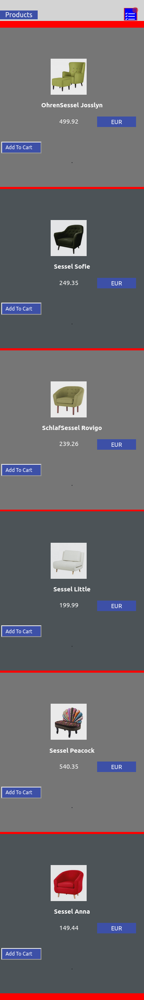

# furniture store app

Sideland : **## shop products online**

> ### Overview :

- let's say you want to add some design in your living room, and make the space more likely. One of your big choice is about furnitures and particularly sofa that you might want to purchase . This little website give you a small inside about how will look your online **furniture shop** website.
- Hope we will enjoy it !

## Interest

You might be interested on how:

- to implement linked page with `redux` **state management** using on _@reduxjs/toolkit_

- or use `bootstrap` inside a _react project_

### Links

- Solution URL: [https://github.com/BeinRain06/furniture-store.git](https://github.com/BeinRain06/furniture-store.git)
- Live Site URL: [https://beinrain06.github.io/furniture-store/](https://beinrain06.github.io/furniture-store/)

## Description : \* challenge issue

**redux reducer actions**

> Redux is particular;y famous when dealing with large scale app that have severals **data** to manage, we were willing to go through this **state management tool** and looks how it works.
>
> **analyzing**

1.  Here is the part we have much had trouble **reducers** in `createSlice`

    > `reducers: {
    > addToCart: (state, action) => {

        const newItem = action.payload;

        const index1 = newItem.id - 1;

        const existingItem = state.myCartProducts.find(
          (item) => item.id === newItem.id
        );

        if (existingItem) {
          existingItem.quantity++;
          existingItem.totalPrice += newItem.price;
          state.productsList[index1].quantity++;
          console.log(existingItem.quantity);
          console.log(existingItem.totalPrice);
        } else {
          state.myCartProducts.push({
            id: newItem.id,
            name: newItem.name,
            price: newItem.price,
            quantity: 1,
            totalPrice: newItem.price,
          });
          state.totalQuantity++;
          state.productsList[index1].quantity = 1;
        }

        state.entireBill = state.myCartProducts.reduce((accumulator, item) => {
          return accumulator + item.totalPrice;
        }, 0);

    },
    }`

    >

- because we need to `understand` really about what is `payload` and how to deal writing functions that could affect state of some variables we declared.
- Here is what we got . **payload** is about what we need to pass to **initialize** or set actions through a given direction.
- For example this syntax of `addToCart` in our cartSlice.js file use **payload** we push first an element to a cart `state.myCartProducts.push(**payload**)`. Here the payload is an **object** variable passed to _myCartsProducts_ array and this direction also move us to set **payload** at the right component **<Product/>** where the the `addToCart`es effectively triggered :
  - `const addToCart = () => {
 dispatch( cartActions.addToCart({ **payload**}));
}` >
- **payload** is all about what you need to achieve a certain action . Payload could be a **number**, an **object**, an **array**, ...

>

2.  with **redux** using **@reduxjs/toolkit** we need two main files:

    - the first to **configure** our storage file `store.js` file.
      >
    - the second to **initialize**, **get** and **set** method to **manages** state change of our app. here that correspond to our `cartSlice.js` file.

>

3.  we have to provide data of our **store** to our entire application (wrap <App/> component located in `index.js` file ) using <Provider>{children}<Provider/> component.

- Here it looks alike:
- `const root = ReactDOM.createRoot(document.getElementById("root"));
root.render(
  <React.StrictMode>
    <Provider store={store}>
      <App />
    </Provider>
  </React.StrictMode>
);`

## CSS Structures:

> two main components in your <App/>:
> -Products.jsx, and Carts.jsx

**Picture**

---

---

# What I learned

### Use Bootstrap Classes in React

All we need to do is to install bootstrap and import **minified version** of css and js in the **indexjs** file of our project.
After that we can use and learn about classes of bootstrap in the source website : [https://getbootstrap.com](https://getbootstrap.com)
Like this:

- command(inside our directory project) : npm install bootstrap
- add :
  - import "bootstrap/dist/css/bootstrap.min.css";
  - import "bootstrap/dist/js/bootstrap.bundle.min";
- Use Classes you need searching over the bunch of classes given in the official website _getbootstrap.com_

### Implement React Redux for small Database

Drive code to **configure** our `store.js` file, **create** and **get** `state` of variables that are likely able to change `createSlice.js` , **provide these data** to our root component (<App/> component ) under `index.js` file.

### utilities Materials:

    -bootstrap and bootstrap icons

### Mobile Responsiveness

    - Mobile reponsiveness for mobile min-width: 230px

**Picture**

---

---

## Callback History:

- **e-commerce** has become a trend in the years 1990's. Why ? People of that age love to grab things just by **one click!**. The first online **marketplace** the **Boston Computer exchanges** tooks place in **1982**. Over the next year Brands like **Amazon**, **Alibaba**, **venmo**, **Etsy**, **eBay**, ... has grown their base and become the most powerfull and known for e-commerce website online.
- >
- **one way** to enhance his enterprize in this age whatever it's a small businness or a large one is to create a presence online to stick audience and clients online. With this small step you may catch people of all area qorund the world which bumps into your website, and then quickly make benefits or increase your selling accounts.

## Useful Resources :

- web Dev Simplified: [https://www.youtube.com/watch?v=s1XVfm5mIuU](https://www.youtube.com/watch?v=s1XVfm5mIuU) : quick reminding explanation on how to use `reduce` **method** of javasript when having array of object variables and need to access specificly a **particular** property inside;

  >

- Colt Steele: [https://www.youtube.com/watch?v=VOQSrdX82L8](https://www.youtube.com/watch?v=VOQSrdX82L8) : in a way similar the prevous video, lead me to know about others uses of `reduce` **method** of javascript inside a project.

  >

- freeCodeCamp.org: [https://www.youtube.com/watch?v=zrs7u6bdbUw&t=1566s](https://www.youtube.com/watch?v=zrs7u6bdbUw&t=1566s) : simply put this one was my guidelines and inspiration to how **manages** state in `react-redux` using **@reduxjs/toolkit** and it works fine. thanks you to **nikhil-thadani** of **freeCodeCamp** . Also it has a given repository under: [Nikhilthadani /
  Redux-Shopping-Cart-App](https://github.com/Nikhilthadani/Redux-Shopping-Cart-App)

## Acknowledge:

This project always remember the Team :

- **Sufa Digital**: udemy with his enlightment about the feature to achieve this project
  >
- **nikhil-thadani** : with his help with a realistic project how manage state with **redux** in react
  >
- **Kyle[web dev Simpliflied]** and also **Colt Sttele** that give us a brief and concise explanation about javascript **reduce** method.

_Our Work always remember this team_

## Author

- Frontend Mentor - [https://www.frontendmentor.io/profile/BeinRain06](https://www.frontendmentor.io/profile/BeinRain06)
- Twitter - [https://twitter.com/nest_Ngoueni](https://twitter.com/nest_Ngoueni)
